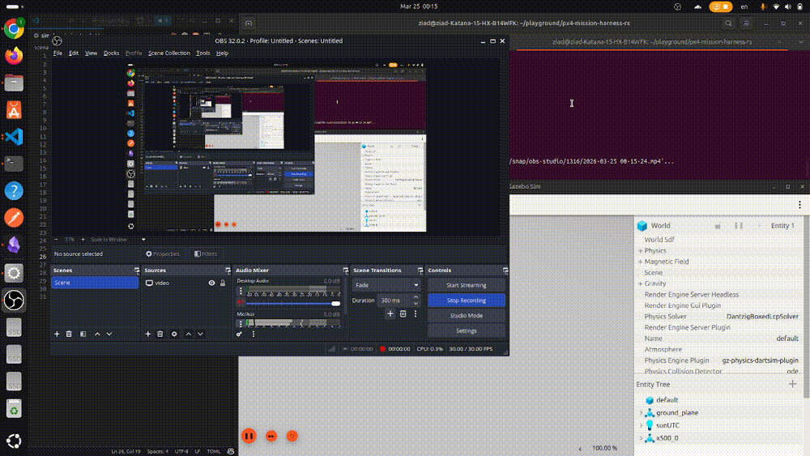

# PX4 Mission Resilience Test Harness

[](https://github.com/ZiadAhmed9/px4-mission-harness-rs/actions)

A Rust-based CLI tool for deterministic, repeatable testing of PX4 drone missions under degraded communication and timing conditions.

## Demo



## The Problem

Drone teams validate missions through SITL simulation runs, manual flight tests, and ad hoc scripts. These methods confirm that a mission works under ideal conditions — but they don't answer harder questions:

- Does the mission still complete when telemetry is delayed by 200ms?
- Does the vehicle behave safely when 10% of packets are lost?
- Are timeout thresholds too aggressive when jitter is introduced?
- Can a previously observed failure be reproduced exactly?

Current workflows test the **happy path**. Real-world communication is unreliable — packets get delayed, dropped, duplicated, or arrive stale. Without structured resilience testing, these failure modes surface late, are hard to reproduce, and are expensive to debug.

## What This Tool Does

The harness sits in the communication path between PX4 SITL and the ground control station. It:

1. **Runs scripted missions** — arm, takeoff, fly waypoints, land — defined in TOML scenario files
2. **Injects communication faults** — delay, jitter, packet loss, burst loss, duplication, stale replay
3. **Evaluates assertions** — did the drone reach the waypoint within tolerance? Did it land within the timeout?
4. **Produces structured reports** — JSON, Markdown, and JUnit XML for CI integration

Scenarios are deterministic and repeatable. Run the same scenario twice, get the same result. Change one fault parameter, see exactly what breaks.

## Example Scenario

```toml
[scenario]
name = "Waypoint mission with 10% packet loss"

[mission]
takeoff_altitude = 10.0

[[mission.waypoints]]
latitude = 47.397742
longitude = 8.545594
altitude = 10.0
acceptance_radius = 5.0

[faults]
loss_rate = 0.1

[[assertions]]
type = "waypoint_reached"
waypoint_index = 0
timeout_secs = 60

[[assertions]]
type = "landed"
timeout_secs = 120
```

## Project Status

- [x] Project scaffolding (Cargo workspace, CLI skeleton)
- [x] Scenario parsing (TOML format, validation, error handling)
- [x] MAVLink connection (heartbeat, basic communication with PX4 SITL)
- [x] Mission controller (arm, takeoff, waypoints, land)
- [x] Telemetry collection (position, attitude, vehicle status)
- [x] Assertion engine (waypoint reached, altitude, landing checks)
- [x] UDP proxy with fault injection (delay, drop, duplicate, jitter, replay)
- [x] Report generation (JSON, Markdown, JUnit XML)
- [x] CLI polish and integration tests

## Stack

| Component | Role |
|---|---|
| **Rust** | Implementation language |
| **Tokio** | Async runtime |
| **MAVLink** (`mavlink` crate) | Direct protocol-level communication with PX4 |
| **PX4 SITL + Gazebo** | Simulated drone environment |
| **TOML** | Scenario definition format |

MAVSDK is intentionally not used. The fault injection layer requires direct control over raw MAVLink packets — MAVSDK abstracts away exactly what we need to manipulate.

## Usage

```bash
# Basic run
cargo run -p px4-harness -- -s scenarios/simple_mission.toml

# With report output
cargo run -p px4-harness -- -s scenarios/simple_mission.toml \
    --json report.json --markdown report.md --junit report.xml

# Custom ports
cargo run -p px4-harness -- -s scenarios/simple_mission.toml \
    --px4-port 14550 --proxy-port 14560

# Verbose telemetry logging
cargo run -p px4-harness -- -s scenarios/simple_mission.toml --verbose
```

## Building & Testing

```bash
cargo build                              # build all crates
cargo run -p px4-harness -- --help       # show CLI options
cargo test                               # run unit tests (no SITL needed)
cargo clippy --workspace                 # lint
cargo fmt --all -- --check               # format check

# Integration tests (requires running PX4 SITL)
cargo test -p px4-harness-core --features sitl -- --nocapture
```

## Architecture

```
px4-mission-harness-rs/
├── crates/
│   ├── px4-harness/          # binary — CLI entry point
│   └── px4-harness-core/     # library — all core logic
│       └── src/
│           ├── mavlink/      # MAVLink connection and parsing
│           ├── proxy/        # UDP proxy with fault injection
│           ├── mission/      # mission execution state machine
│           ├── fault/        # fault profiles
│           ├── assertion/    # pass/fail checks against telemetry
│           └── report/       # output generation
├── scenarios/                # TOML scenario files
└── Documentation/            # design docs and phase guides
```

## License

Licensed under either of:

- Apache License, Version 2.0 ([LICENSE-APACHE](LICENSE-APACHE) or http://www.apache.org/licenses/LICENSE-2.0)
- MIT License ([LICENSE-MIT](LICENSE-MIT) or http://opensource.org/licenses/MIT)

at your option.
